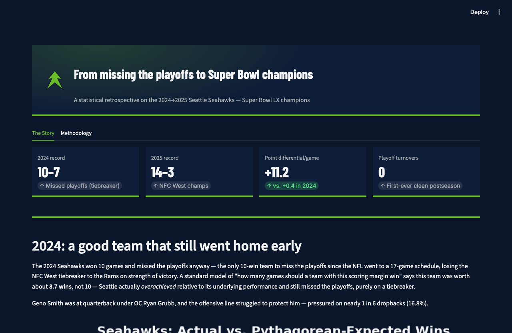
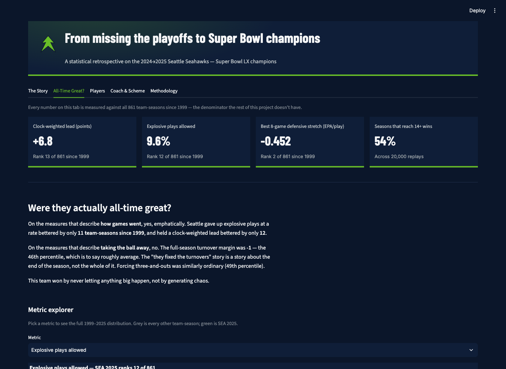
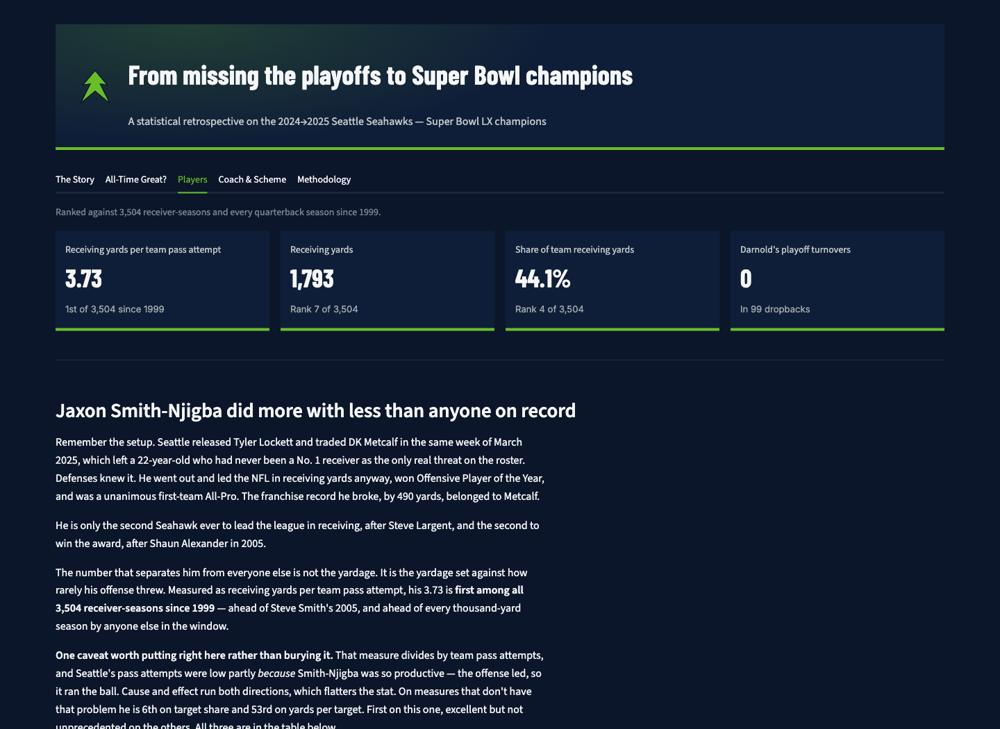
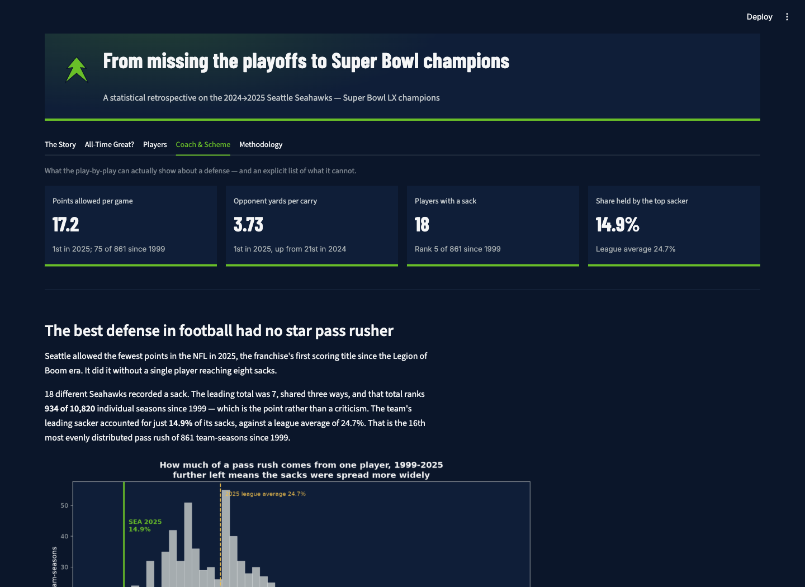

# Seahawks Super Bowl LX Retrospective

A data science / statistics portfolio project on how the Seattle Seahawks
went from missing the playoffs in 2024 (10–7) to winning Super Bowl LX in
2025 (14–3) — Sam Darnold led the NFL in regular-season turnovers, then
posted zero across three playoff wins.

Full write-up: **[REPORT.md](REPORT.md)** — plain-language story plus a
"Technical Details & Methodology" section (Pythagorean win expectation,
z-scores/Mahalanobis distance, a Poisson rate model, and a regression
decomposition).

## Dashboard



A five-tab Streamlit app:

- **The Story** — plain-language narrative, headline charts, an interactive
  season-trend explorer.
- **All-Time Great?** — where the 2025 team sits among all 861 team-seasons
  since 1999. Interactive metric explorer, per-game win-probability curves,
  and a champion comparison you can re-rank between the published statistic
  and the clock-weighted version.
- **Players** — Jaxon Smith-Njigba against all 3,504 receiver-seasons since
  1999 (first all-time in receiving yards per team pass attempt), and Sam
  Darnold's full career turnover arc across five franchises.
- **Coach & Scheme** — how Seattle's sacks were distributed, the 2024→2025
  change in the same defensive unit, and an explicit list of what this data
  cannot say about Mike Macdonald's scheme.
- **Methodology** — the statistical detail behind all of it, including a
  claim-by-claim table of which published figures the data supports.







Reads only from `outputs/` and `data/processed/` — no live recomputation.

## Repo layout

- `data/raw/` — cached raw pull from nflverse (not committed; re-fetchable via `src/data_acquisition.py`)
- `data/processed/` — engineered feature files used by later analysis and the dashboard (team-season tables plus per-receiver, per-passer, per-defender and per-rusher season tables)
- `src/` — pipeline and analysis code, one script per phase
- `outputs/` — analysis results (JSON) and charts
- `dashboard/` — Streamlit app (`app.py`)
- `tests/` — unit tests for the pure calculation functions (Pythagorean expectation, turnover-probability model, OLS decomposition, clock-weighted margin / percentile / rolling-window / concentration kernels, plus fixture tests guarding the player-frame denominators)
- `docs/` — README assets
- `REFERENCES.md` — data source and citation log
- `HANDOFF.md` — the original phase-by-phase project plan

## Setup

Requires Python 3.12+.

```bash
uv venv
uv pip install -r requirements.txt
```

## Running the pipeline

Each phase is a standalone script; run in order (Phase 1 caches the raw
data everything downstream depends on):

```bash
uv run python src/feasibility_check.py     # Phase 0: confirm network access to nflverse
uv run python src/data_acquisition.py      # Phase 1: pull + cache raw data to data/raw/
uv run python src/phase2_puzzle.py         # Phase 2: 2024 Pythagorean win-expectation gap
uv run python src/phase3_personnel.py      # Phase 3: QB/OC personnel deltas
uv run python src/phase4_deep_dive.py      # Phase 4: EPA/turnover/red-zone/pressure features
uv run python src/phase5_anomaly_detection.py  # Phase 5: defense anomaly detection (z-scores, Mahalanobis)
uv run python src/phase6_turnover_rate_model.py # Phase 6: zero-turnover playoff probability
uv run python src/phase7_decomposition.py  # Phase 7: regression decomposition of the 2024->2025 jump

uv run python src/season_metrics.py        # build the 1999-2025 team-season tables
uv run python src/phase13_historical_baseline.py  # Phase 13: percentile rank vs 861 team-seasons
uv run python src/phase14_game_control.py  # Phase 14: clock-weighted margin and game control
uv run python src/phase15_defense.py       # Phase 15: rolling defensive EPA vs every team-season
uv run python src/phase16_counterfactual.py # Phase 16: Pythagorean, Monte Carlo, turnover luck
uv run python src/phase17_players.py       # Phase 17: Smith-Njigba and Darnold vs every player-season
uv run python src/phase18_scheme.py        # Phase 18: pass-rush distribution and the 2024->2025 defense
```

Phases 5 and 6 only depend on Phase 1's cached data and can run in either
order; Phases 2–4 and 7 depend on the outputs before them in the list.

Phases 13–18 all read `season_metrics.py`'s committed CSVs, so once those exist
the six can run in any order. `season_metrics.py` is the only module that opens
raw play-by-play; it emits the team tables plus four player-level tables
(`receiver_season.csv`, `passer_season.csv`, `defender_season.csv`,
`rusher_season.csv`) that Phases 17–18 read. Note that `data_acquisition.py` now pulls
**1999–2025** rather than 2010–2025 — the first run after this change downloads
eleven additional seasons of play-by-play (cached per season, so it resumes
cleanly if interrupted).

## Running the dashboard

```bash
uv run streamlit run dashboard/app.py
```

## Tests and lint

```bash
uv pip install -r requirements-dev.txt
uv run pytest
uvx ruff check .
```

## Status

Phases 1–18 complete. `HANDOFF.md` holds the original phase-by-phase plan
(through Phase 11); Phases 12–18 — the visual redesign, the all-time
comparison, and the player and coach deep dives — were scoped afterwards.
